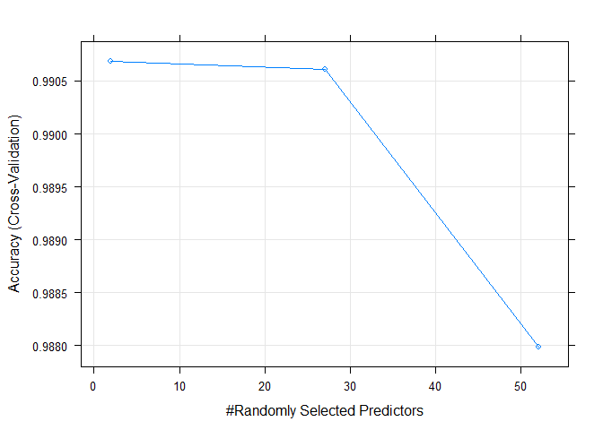
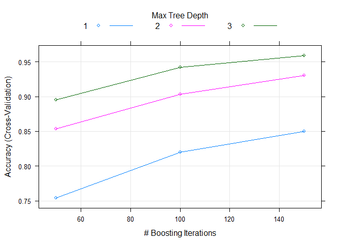
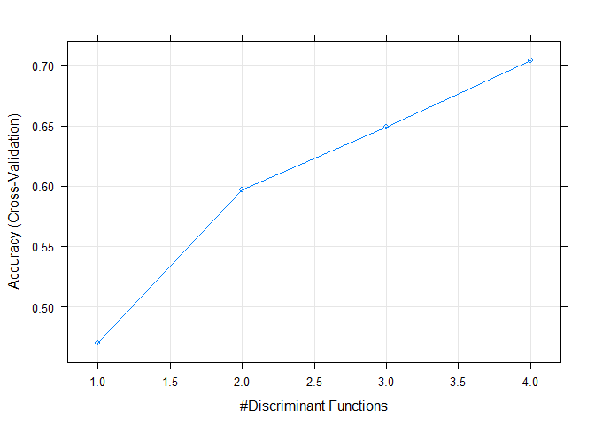

## Synopsis

This research is to predict whether or not six young health participants were asked to perform one set of 10 repetitions of the Unilateral Dumbbell Biceps Curl in five different fashions: 

1. Exactly according to the specification (Class A)
2. Throwing the elbows to the front (Class B)
3. Lifting the dumbbell only halfway (Class C)
4. Lowering the dumbbell only halfway (Class D)
5. Throwing the hips to the front (Class E).

We will attempt to create a predictive model that can correctly classify the results.

## Load Data


```r
if(!file.exists("Exercise_Training_Data.csv")){
  download.file("https://d396qusza40orc.cloudfront.net/predmachlearn/pml-training.csv", "Exercise_Training_Data.csv")
}

if(!file.exists("Exercise_Testing_Data.csv")){
  download.file("https://d396qusza40orc.cloudfront.net/predmachlearn/pml-testing.csv", "Exercise_Testing_Data.csv")
}

#Make sure empty strings are marked as NA since we will remove them later
training <- read.csv(file="Exercise_Training_Data.csv", na.strings = c("NA",""))
testing <- read.csv(file="Exercise_Testing_Data.csv", na.strings = c("NA",""))
```

## Data Cleaning & Exploratory Analysis


```r
#Do some initial analysis on the data
dim(training)
```

```
## [1] 19622   160
```

```r
str(training)
```

```
## 'data.frame':	19622 obs. of  160 variables:
##  $ X                       : int  1 2 3 4 5 6 7 8 9 10 ...
##  $ user_name               : Factor w/ 6 levels "adelmo","carlitos",..: 2 2 2 2 2 2 2 2 2 2 ...
##  $ raw_timestamp_part_1    : int  1323084231 1323084231 1323084231 1323084232 1323084232 1323084232 1323084232 1323084232 1323084232 1323084232 ...
##  $ raw_timestamp_part_2    : int  788290 808298 820366 120339 196328 304277 368296 440390 484323 484434 ...
##  $ cvtd_timestamp          : Factor w/ 20 levels "02/12/2011 13:32",..: 9 9 9 9 9 9 9 9 9 9 ...
##  $ new_window              : Factor w/ 2 levels "no","yes": 1 1 1 1 1 1 1 1 1 1 ...
##  $ num_window              : int  11 11 11 12 12 12 12 12 12 12 ...
##  $ roll_belt               : num  1.41 1.41 1.42 1.48 1.48 1.45 1.42 1.42 1.43 1.45 ...
##  $ pitch_belt              : num  8.07 8.07 8.07 8.05 8.07 8.06 8.09 8.13 8.16 8.17 ...
##  $ yaw_belt                : num  -94.4 -94.4 -94.4 -94.4 -94.4 -94.4 -94.4 -94.4 -94.4 -94.4 ...
##  $ total_accel_belt        : int  3 3 3 3 3 3 3 3 3 3 ...
##  $ kurtosis_roll_belt      : Factor w/ 396 levels "-0.016850","-0.021024",..: NA NA NA NA NA NA NA NA NA NA ...
##  $ kurtosis_picth_belt     : Factor w/ 316 levels "-0.021887","-0.060755",..: NA NA NA NA NA NA NA NA NA NA ...
##  $ kurtosis_yaw_belt       : Factor w/ 1 level "#DIV/0!": NA NA NA NA NA NA NA NA NA NA ...
##  $ skewness_roll_belt      : Factor w/ 394 levels "-0.003095","-0.010002",..: NA NA NA NA NA NA NA NA NA NA ...
##  $ skewness_roll_belt.1    : Factor w/ 337 levels "-0.005928","-0.005960",..: NA NA NA NA NA NA NA NA NA NA ...
##  $ skewness_yaw_belt       : Factor w/ 1 level "#DIV/0!": NA NA NA NA NA NA NA NA NA NA ...
##  $ max_roll_belt           : num  NA NA NA NA NA NA NA NA NA NA ...
##  $ max_picth_belt          : int  NA NA NA NA NA NA NA NA NA NA ...
##  $ max_yaw_belt            : Factor w/ 67 levels "-0.1","-0.2",..: NA NA NA NA NA NA NA NA NA NA ...
##  $ min_roll_belt           : num  NA NA NA NA NA NA NA NA NA NA ...
##  $ min_pitch_belt          : int  NA NA NA NA NA NA NA NA NA NA ...
##  $ min_yaw_belt            : Factor w/ 67 levels "-0.1","-0.2",..: NA NA NA NA NA NA NA NA NA NA ...
##  $ amplitude_roll_belt     : num  NA NA NA NA NA NA NA NA NA NA ...
##  $ amplitude_pitch_belt    : int  NA NA NA NA NA NA NA NA NA NA ...
##  $ amplitude_yaw_belt      : Factor w/ 3 levels "#DIV/0!","0.00",..: NA NA NA NA NA NA NA NA NA NA ...
##  $ var_total_accel_belt    : num  NA NA NA NA NA NA NA NA NA NA ...
##  $ avg_roll_belt           : num  NA NA NA NA NA NA NA NA NA NA ...
##  $ stddev_roll_belt        : num  NA NA NA NA NA NA NA NA NA NA ...
##  $ var_roll_belt           : num  NA NA NA NA NA NA NA NA NA NA ...
##  $ avg_pitch_belt          : num  NA NA NA NA NA NA NA NA NA NA ...
##  $ stddev_pitch_belt       : num  NA NA NA NA NA NA NA NA NA NA ...
##  $ var_pitch_belt          : num  NA NA NA NA NA NA NA NA NA NA ...
##  $ avg_yaw_belt            : num  NA NA NA NA NA NA NA NA NA NA ...
##  $ stddev_yaw_belt         : num  NA NA NA NA NA NA NA NA NA NA ...
##  $ var_yaw_belt            : num  NA NA NA NA NA NA NA NA NA NA ...
##  $ gyros_belt_x            : num  0 0.02 0 0.02 0.02 0.02 0.02 0.02 0.02 0.03 ...
##  $ gyros_belt_y            : num  0 0 0 0 0.02 0 0 0 0 0 ...
##  $ gyros_belt_z            : num  -0.02 -0.02 -0.02 -0.03 -0.02 -0.02 -0.02 -0.02 -0.02 0 ...
##  $ accel_belt_x            : int  -21 -22 -20 -22 -21 -21 -22 -22 -20 -21 ...
##  $ accel_belt_y            : int  4 4 5 3 2 4 3 4 2 4 ...
##  $ accel_belt_z            : int  22 22 23 21 24 21 21 21 24 22 ...
##  $ magnet_belt_x           : int  -3 -7 -2 -6 -6 0 -4 -2 1 -3 ...
##  $ magnet_belt_y           : int  599 608 600 604 600 603 599 603 602 609 ...
##  $ magnet_belt_z           : int  -313 -311 -305 -310 -302 -312 -311 -313 -312 -308 ...
##  $ roll_arm                : num  -128 -128 -128 -128 -128 -128 -128 -128 -128 -128 ...
##  $ pitch_arm               : num  22.5 22.5 22.5 22.1 22.1 22 21.9 21.8 21.7 21.6 ...
##  $ yaw_arm                 : num  -161 -161 -161 -161 -161 -161 -161 -161 -161 -161 ...
##  $ total_accel_arm         : int  34 34 34 34 34 34 34 34 34 34 ...
##  $ var_accel_arm           : num  NA NA NA NA NA NA NA NA NA NA ...
##  $ avg_roll_arm            : num  NA NA NA NA NA NA NA NA NA NA ...
##  $ stddev_roll_arm         : num  NA NA NA NA NA NA NA NA NA NA ...
##  $ var_roll_arm            : num  NA NA NA NA NA NA NA NA NA NA ...
##  $ avg_pitch_arm           : num  NA NA NA NA NA NA NA NA NA NA ...
##  $ stddev_pitch_arm        : num  NA NA NA NA NA NA NA NA NA NA ...
##  $ var_pitch_arm           : num  NA NA NA NA NA NA NA NA NA NA ...
##  $ avg_yaw_arm             : num  NA NA NA NA NA NA NA NA NA NA ...
##  $ stddev_yaw_arm          : num  NA NA NA NA NA NA NA NA NA NA ...
##  $ var_yaw_arm             : num  NA NA NA NA NA NA NA NA NA NA ...
##  $ gyros_arm_x             : num  0 0.02 0.02 0.02 0 0.02 0 0.02 0.02 0.02 ...
##  $ gyros_arm_y             : num  0 -0.02 -0.02 -0.03 -0.03 -0.03 -0.03 -0.02 -0.03 -0.03 ...
##  $ gyros_arm_z             : num  -0.02 -0.02 -0.02 0.02 0 0 0 0 -0.02 -0.02 ...
##  $ accel_arm_x             : int  -288 -290 -289 -289 -289 -289 -289 -289 -288 -288 ...
##  $ accel_arm_y             : int  109 110 110 111 111 111 111 111 109 110 ...
##  $ accel_arm_z             : int  -123 -125 -126 -123 -123 -122 -125 -124 -122 -124 ...
##  $ magnet_arm_x            : int  -368 -369 -368 -372 -374 -369 -373 -372 -369 -376 ...
##  $ magnet_arm_y            : int  337 337 344 344 337 342 336 338 341 334 ...
##  $ magnet_arm_z            : int  516 513 513 512 506 513 509 510 518 516 ...
##  $ kurtosis_roll_arm       : Factor w/ 329 levels "-0.02438","-0.04190",..: NA NA NA NA NA NA NA NA NA NA ...
##  $ kurtosis_picth_arm      : Factor w/ 327 levels "-0.00484","-0.01311",..: NA NA NA NA NA NA NA NA NA NA ...
##  $ kurtosis_yaw_arm        : Factor w/ 394 levels "-0.01548","-0.01749",..: NA NA NA NA NA NA NA NA NA NA ...
##  $ skewness_roll_arm       : Factor w/ 330 levels "-0.00051","-0.00696",..: NA NA NA NA NA NA NA NA NA NA ...
##  $ skewness_pitch_arm      : Factor w/ 327 levels "-0.00184","-0.01185",..: NA NA NA NA NA NA NA NA NA NA ...
##  $ skewness_yaw_arm        : Factor w/ 394 levels "-0.00311","-0.00562",..: NA NA NA NA NA NA NA NA NA NA ...
##  $ max_roll_arm            : num  NA NA NA NA NA NA NA NA NA NA ...
##  $ max_picth_arm           : num  NA NA NA NA NA NA NA NA NA NA ...
##  $ max_yaw_arm             : int  NA NA NA NA NA NA NA NA NA NA ...
##  $ min_roll_arm            : num  NA NA NA NA NA NA NA NA NA NA ...
##  $ min_pitch_arm           : num  NA NA NA NA NA NA NA NA NA NA ...
##  $ min_yaw_arm             : int  NA NA NA NA NA NA NA NA NA NA ...
##  $ amplitude_roll_arm      : num  NA NA NA NA NA NA NA NA NA NA ...
##  $ amplitude_pitch_arm     : num  NA NA NA NA NA NA NA NA NA NA ...
##  $ amplitude_yaw_arm       : int  NA NA NA NA NA NA NA NA NA NA ...
##  $ roll_dumbbell           : num  13.1 13.1 12.9 13.4 13.4 ...
##  $ pitch_dumbbell          : num  -70.5 -70.6 -70.3 -70.4 -70.4 ...
##  $ yaw_dumbbell            : num  -84.9 -84.7 -85.1 -84.9 -84.9 ...
##  $ kurtosis_roll_dumbbell  : Factor w/ 397 levels "-0.0035","-0.0073",..: NA NA NA NA NA NA NA NA NA NA ...
##  $ kurtosis_picth_dumbbell : Factor w/ 400 levels "-0.0163","-0.0233",..: NA NA NA NA NA NA NA NA NA NA ...
##  $ kurtosis_yaw_dumbbell   : Factor w/ 1 level "#DIV/0!": NA NA NA NA NA NA NA NA NA NA ...
##  $ skewness_roll_dumbbell  : Factor w/ 400 levels "-0.0082","-0.0096",..: NA NA NA NA NA NA NA NA NA NA ...
##  $ skewness_pitch_dumbbell : Factor w/ 401 levels "-0.0053","-0.0084",..: NA NA NA NA NA NA NA NA NA NA ...
##  $ skewness_yaw_dumbbell   : Factor w/ 1 level "#DIV/0!": NA NA NA NA NA NA NA NA NA NA ...
##  $ max_roll_dumbbell       : num  NA NA NA NA NA NA NA NA NA NA ...
##  $ max_picth_dumbbell      : num  NA NA NA NA NA NA NA NA NA NA ...
##  $ max_yaw_dumbbell        : Factor w/ 72 levels "-0.1","-0.2",..: NA NA NA NA NA NA NA NA NA NA ...
##  $ min_roll_dumbbell       : num  NA NA NA NA NA NA NA NA NA NA ...
##  $ min_pitch_dumbbell      : num  NA NA NA NA NA NA NA NA NA NA ...
##  $ min_yaw_dumbbell        : Factor w/ 72 levels "-0.1","-0.2",..: NA NA NA NA NA NA NA NA NA NA ...
##  $ amplitude_roll_dumbbell : num  NA NA NA NA NA NA NA NA NA NA ...
##   [list output truncated]
```

```r
#Get rid of any columns with NA's or else the training will fail with an error
training <- training[ ,!apply(is.na(training), 2, any)]
#Realized there was some user data (names & timestamps) that was being used by the model and was extremely overfitting the model to 1, so remove that data as it should not be measured
training <- training[, -c(1:7)]
dim(training)
```

```
## [1] 19622    53
```

```r
#Get rid of any columns with NA's or else the testing will fail with an error
testing <- testing[ ,!apply(is.na(testing), 2, any)]
#Realized there was some user data (names & timestamps) that was being used by the model and was extremely overfitting the model to 1, so remove that data as it should not be measured
testing <- testing[, -c(1:7)]
dim(testing)
```

```
## [1] 20 53
```

```r
#We have 5 unique exercises
unique(training$classe)
```

```
## [1] A B C D E
## Levels: A B C D E
```

After adjusting for NA's we lose around 6,000 rows and have removed 7 unneeded columns. We can now move on to modeling.

## Modeling

Let's try three different modeling techniques to see which one is the most accurate. We will use a 5 fold fit for cross-validation purposes.


```r
library(caret)
set.seed(487)

#Prefer to use 70/30 split on data so as to prevent overfit
part <- createDataPartition(training$classe, p = 0.7, list = FALSE)
train <- training[part, ]
test <- training[-part, ]

#Run time was terrible, so found some instructions here on making it perform much faster
#https://github.com/lgreski/datasciencectacontent/blob/master/markdown/pml-randomForestPerformance.md

library(parallel)
library(doParallel)
#convention to leave 1 core for OS
cluster <- makeCluster(detectCores() - 1)
registerDoParallel(cluster)

#Use 5 folds
fit <- trainControl(method="cv", number=5, allowParallel=TRUE)
```

## Random Forest


```r
rf_model <- train(classe ~ ., method="rf", data=train, trControl=fit, verbose=FALSE)
plot(rf_model)
```

<!-- -->

We can see that between 2 and 27 random predictors, that the accuracy is better than 99%, but as more are introduced the accuracy falls slightly to 98%. This may suggest that many of the predictors have strong dependencies between each other.


```r
rf_predict <- predict(rf_model, newdata=test)
rf_matrix <- confusionMatrix(rf_predict, test$classe)
rf_matrix$overall["Accuracy"]
```

```
##  Accuracy 
## 0.9943925
```

```r
rf_matrix$table
```

```
##           Reference
## Prediction    A    B    C    D    E
##          A 1674    8    0    0    0
##          B    0 1129    9    0    0
##          C    0    2 1016   12    0
##          D    0    0    1  952    1
##          E    0    0    0    0 1081
```

We can see that we get a 99.4% accuracy, and that the matrix table verifies this with the handful of overfitted values in each category.

## Gradient Boosting Method (GBM)


```r
gbm_model <- train(classe ~ ., method="gbm", data=train, trControl=fit, verbose=FALSE)
plot(gbm_model)
```

<!-- -->

We can see that after just 3 levels of decision trees our accuracy is 96%. We can also see that after 100 iterations the data accuracy grows slowly. Once again this would seem to validate our earlier assumption that the variables are highly dependent on each other.


```r
gbm_predict <- predict(gbm_model, newdata=test)
gbm_matrix <- confusionMatrix(gbm_predict, test$classe)
gbm_matrix$overall["Accuracy"]
```

```
## Accuracy 
## 0.962277
```

```r
gbm_matrix$table
```

```
##           Reference
## Prediction    A    B    C    D    E
##          A 1651   37    0    0    1
##          B   15 1068   28    2   18
##          C    3   30  985   35    7
##          D    4    3   11  920   17
##          E    1    1    2    7 1039
```

We confirm the accuracy is 96%, and can also see by the gmb table that most of the data fits nicely.

## Linear Discriminant Analysis (LDA)


```r
lda_model <- train(classe ~ ., method="lda2", data=train, trControl=fit, verbose=FALSE)
plot(lda_model)
```

<!-- -->

It is clear from the plot that lda's accuracy is low as it tries to maximize variable seperation but cannot, probably due to the similar movement in the different exercises, but with only slight variations.


```r
lda_predict <- predict(lda_model, newdata=test)
lda_matrix <- confusionMatrix(lda_predict, test$classe)
lda_matrix$overall["Accuracy"]
```

```
##  Accuracy 
## 0.6953271
```

```r
lda_matrix$table
```

```
##           Reference
## Prediction    A    B    C    D    E
##          A 1342  179   95   55   40
##          B   35  727  106   41  200
##          C  157  144  658  111   82
##          D  134   37  138  715  110
##          E    6   52   29   42  650
```

At 69% it is the worst of all the models. With an out-of-sample error rate of nearly 31% it is an unreliable model.

## Combine All Models

It doesn't appear like we can get a better outcome than random forest, but let's see.


```r
combine <- data.frame(rf_predict, gbm_predict, lda_predict, classe = test$classe)
combine_model <- train(classe ~ ., method = "rf", data = combine)
combine_predict <- predict(combine_model, newdata=combine)
combine_matrix <- confusionMatrix(combine_predict, test$classe)
combine_matrix$overall["Accuracy"]
```

```
##  Accuracy 
## 0.9943925
```

As we predicted we were only able to match the best accuracy of random forest.


## Analysis

RF: **Best** with 99% coverage, with a 1% out-of-sample error.

GBM: 96% coverage, with a 4% out-of-sample error. 

LDA: **Worst** with 69% coverage, but with a 30% out-of-sample error. This could be accounted for by the strong correlation of the variables that cannot be seperated by LDA.

## Final Prediction Analysis

Predict the outcome on our large testing set for the 20 quiz questions.


```r
final_predict <- predict(rf_model, newdata=testing)
final_predict
```

```
##  [1] B A B A A E D B A A B C B A E E A B B B
## Levels: A B C D E
```
